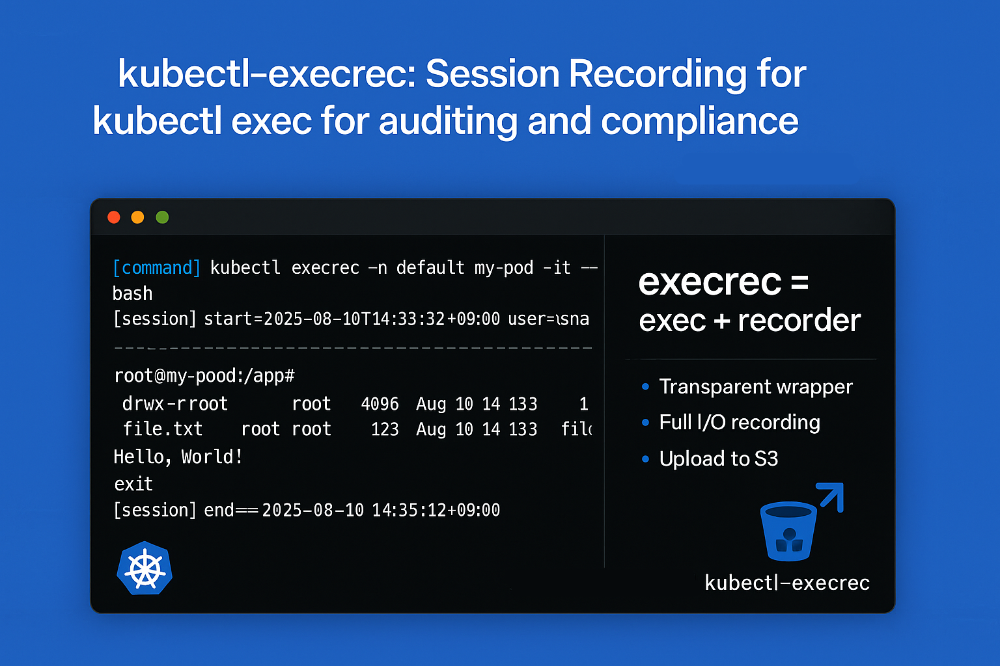

# kubectl-execrec

**execrec** = **exec** + **rec**order



A kubectl plugin that wraps `kubectl exec` with session recording capabilities for audit and compliance with security. All interactive sessions are automatically logged to timestamped files for audit and debugging purposes with `kubectl execrec`. [More details](https://xingyahao.com/posts/kubectl-execrec-session-recording-for-kubectl-exec-for-auditing-and-compliance-with-security/)

## Features

- **Session Audit Logging**: Automatically logs all `kubectl exec` sessions to timestamped files
- **Interactive Support**: Full PTY support with tab completion and interactive commands
- **Audit Trail**: Complete session history with command, user, start/end timestamps
- **Transparent Wrapper**: Works exactly like `kubectl exec` with no additional flags needed

## Installation

### Using Krew (Recommended)

```bash
kubectl krew index add keidarcy https://github.com/keidarcy/kubectl-execrec.git
kubectl krew install keidarcy/execrec
```

### Manual Installation

1. Download the latest release for your platform
2. Make it executable: `chmod +x kubectl-execrec`
3. Move to your PATH: `mv kubectl-execrec /usr/local/bin/`

## Usage

`kubectl execrec` works exactly like `kubectl exec` - just replace `kubectl exec` with `kubectl execrec`:

```bash
# Basic usage
kubectl execrec -n namespace pod-name -it -- bash

# Execute a command
kubectl execrec -n default my-pod -- ls -la

# Interactive shell
kubectl execrec -n kube-system pod-name -it -- sh
```

### Examples

```bash
# Connect to a pod in the default namespace
kubectl execrec my-pod -it -- bash

# Connect to a pod in a specific namespace
kubectl execrec -n production web-server -it -- bash

# Execute a one-off command
kubectl execrec -n staging app-pod -- cat /etc/hosts

# Connect to a specific container in a multi-container pod
kubectl execrec -n default pod-name -c sidecar -it -- sh
```

## Session Logging

Every session is automatically logged to a file in the system's temporary directory with the format:

```
kubectl-execrec/username_2025-08-10T14:33:32+09:00.log
```

### Log File Format

Each log file contains:

```
[command] kubectl execrec -n namespace pod-name -it -- bash
[session] start=2025-08-10T14:33:32+09:00 user=username
================================================================================
root@pod-name:/app# ls -la
total 1234
drwxr-xr-x 1 root root 4096 Aug 10 14:33 .
drwxr-xr-x 1 root root 4096 Aug 10 14:33 ..
-rw-r--r-- 1 root root  123 Aug 10 14:33 file.txt
root@pod-name:/app# exit
exit
================================================================================
[session] end=2025-08-10T14:35:12+09:00
```

### Log File Location

- **macOS**: `/var/folders/.../T/kubectl-execrec/username_timestamp.log`
- **Linux**: `/tmp/kubectl-execrec/username_timestamp.log`
- **Windows**: `%TEMP%\kubectl-execrec/username_timestamp.log`

### Log File Upload (Optional)

Log files can be automatically uploaded to S3 or S3-compatible storage services(other storage services are not supported yet).

#### Environment Variables

- **`KUBECTL_EXECREC_S3_BUCKET`**: S3 bucket name (required for upload)
- **`KUBECTL_EXECREC_S3_ENDPOINT`**: Custom S3 endpoint URL (optional)

#### Usage Examples

```bash
# Standard AWS S3
export KUBECTL_EXECREC_S3_BUCKET=my-logs-bucket
kubectl execrec -n default my-pod -it -- bash
```

```bash
# MinIO (local or remote)
# docker run -d --name minio -p 9000:9000 -p 9001:9001 -e MINIO_ROOT_USER=minioadmin -e MINIO_ROOT_PASSWORD=minioadmin quay.io/minio/minio server /data --console-address ":9001"
# export AWS_ACCESS_KEY_ID=minioadmin
# export AWS_SECRET_ACCESS_KEY=minioadmin
# export AWS_DEFAULT_REGION=us-east-1
# aws s3 --endpoint-url http://localhost:9000 mb s3://kubectl-execrec
export KUBECTL_EXECREC_S3_BUCKET=kubectl-execrec
export KUBECTL_EXECREC_S3_ENDPOINT=http://localhost:9000
kubectl execrec -n default my-pod -it -- bash
```

#### Prerequisites

- AWS CLI installed and configured
- Appropriate credentials for the S3 bucket

## License

This project is licensed under the MIT License - see the [LICENSE](LICENSE) file for details.

## Author
Xing Yahao - [GitHub](https://github.com/keidarcy)
